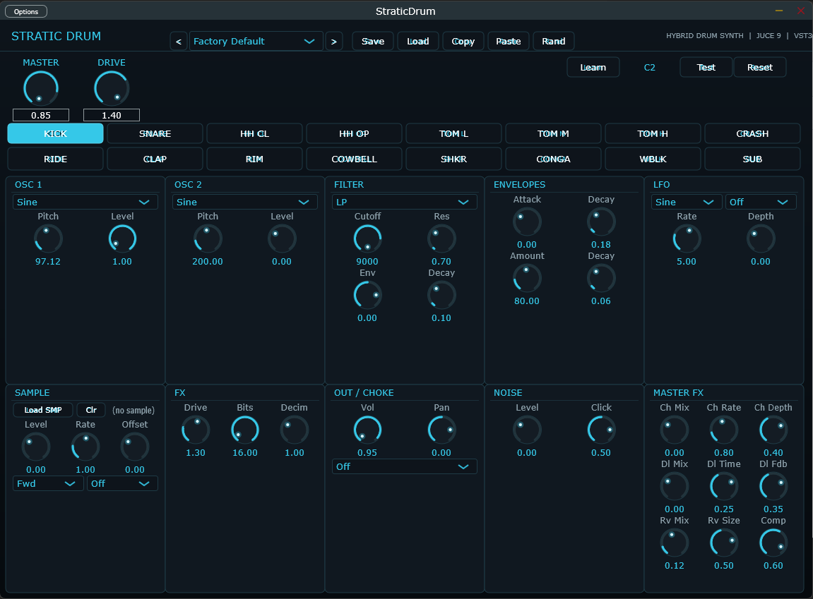

# StraticDrum

A 16-voice hybrid drum synthesizer plugin (VST3 / Standalone) built with JUCE 9.
Every voice combines synthesized oscillators, noise, a multimode filter, envelopes, LFO,
per-voice FX and a sample layer — wrapped in a neon "Stratic" interface.

## Features

- **16 voices**: Kick, Snare, HH Closed/Open, Tom L/M/H, Crash, Ride, Clap, Rim, Cowbell, Shaker, Conga, Woodblock, Sub Kick
- **Per-voice synthesis**:
  - 2 oscillators (Sine / Tri / Saw / Square) + noise + stick-click transient
  - Multimode filter (LP / HP / BP) with resonance and filter envelope
  - Amp & pitch envelopes, LFO with 4 targets (Cutoff / Pitch / Volume)
  - Per-voice FX: drive, bitcrusher, decimator
  - Sample layer: load wav/aiff/flac/mp3/ogg, reverse, loop, offset, rate
- Choke groups, per-voice pan (equal-power)
- MIDI-learn for all 16 pads
- Master FX chain: chorus -> delay -> reverb -> limiter (soft-clip safety)
- **29 factory presets**: acoustic kits (rock, jazz, funk, country, latin), electronic (808/909, trap, techno, house, DnB, EDM), dark (horror, ambient, industrial), cinematic
- Kit save/load (.lpdk), copy/paste/random per voice

## Factory presets

| Group | Presets |
|---|---|
| Signature | Factory Default, Linkin Park Kit |
| Electronic | 909 Electro, Analog 808, Synthwave Pulse, Trap 808 Hard, Techno Peak, House Classic, Drum & Bass, EDM Festival, Synth Pop 80s |
| Lo-fi / dark | LoFi Boom Bap, Horror Ritual, Dark Ambient, Industrial Metal, Dub Space, Cinema Hits |
| Acoustic | Acoustic Rock, Jazz Brush, Funk 70s, Pop Session, Country Road, Garage Rock, Disco 70s, Reggae One Drop |
| Percussion | Latin Percussion, Afrobeat Groove, World Percussion |
| Heavy | Metal Forge |

## Default MIDI map

| Note | Voice | Note | Voice |
|---|---|---|---|
| 35 | Sub Kick | 45 | Tom High |
| 36 | Kick | 46 | HH Open |
| 37 | Rim | 49 | Crash |
| 38 | Snare | 51 | Ride |
| 39 | Clap | 56 | Cowbell |
| 41 | Tom Low | 64 | Conga |
| 42 | HH Closed | 70 | Shaker |
| 43 | Tom Mid | 75 | Woodblock |

Click **Learn** on any voice and hit a pad to re-assign. Mapping is stored with your DAW project and in .lpdk kits.

## Build from source (Windows)

1. Install JUCE 9 (https://juce.com/get-juce) and Visual Studio 2022/2026 with the C++ workload.
2. Open `StraticDrum.jucer` in Projucer, press Ctrl+S (regenerates exporters if needed).
3. Open `Builds/VisualStudio2026/StraticDrum.sln`, select **Release | x64**, Build Solution.
4. Outputs:
   - `Builds/VisualStudio2026/x64/Release/VST3/StraticDrum.vst3`
   - `Builds/VisualStudio2026/x64/Release/Standalone Plugin/StraticDrum.exe`

> If Windows Smart App Control blocks the binaries: right-click -> Properties -> Unblock.

## Quick recipes

- Tight rock kick: OSC1 Sine 48 Hz, Pitch Env 130, Decay 0.22, Click 0.4
- 909-ish snare: Noise 0.9, OSC1 Tri 200 Hz (low level), HP 500 Hz, Decay 0.13
- Hip-hop clap: Noise 1.0, BP 1500 Hz, Res 3, Bits 10, Decim 2
- Dub space: Master FX Dl Mix 0.4, Dl Time 0.38, Rv Mix 0.3
- Horror toms: Tom L pitch LFO 0.3 Hz, depth 0.4, Rv Mix 0.5

## License

MIT - see [LICENSE](LICENSE).